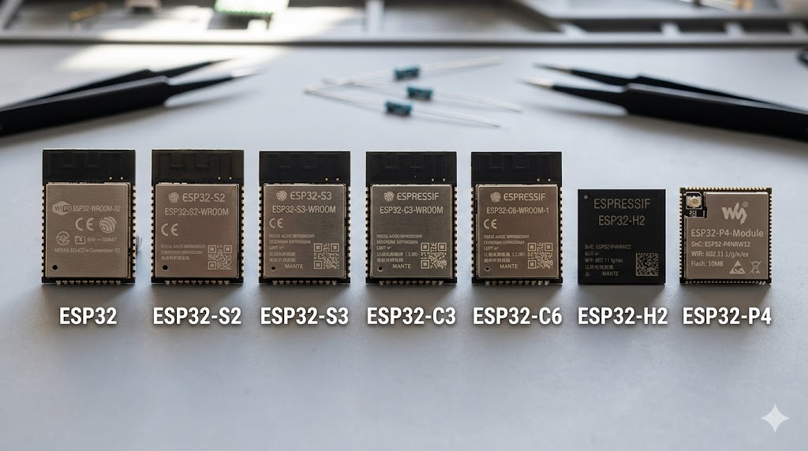
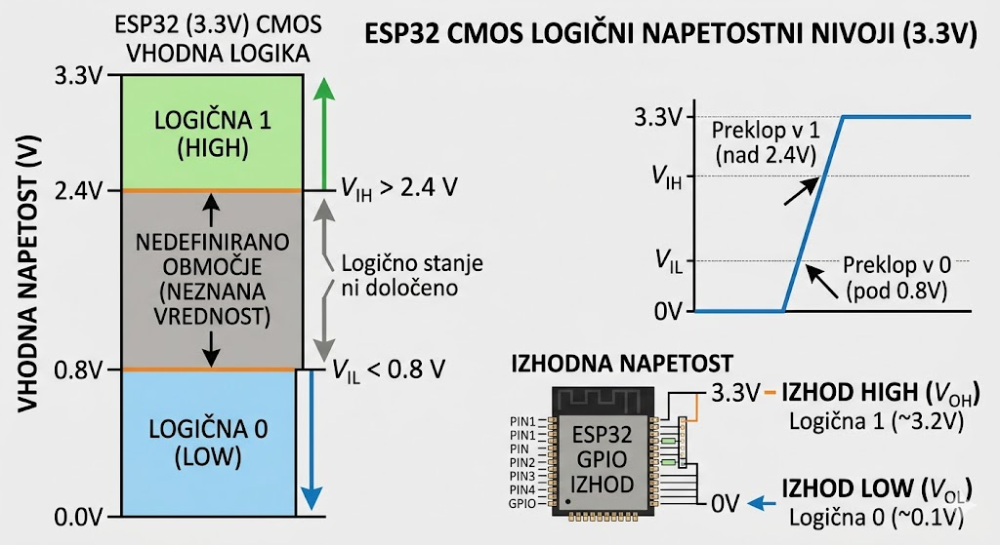
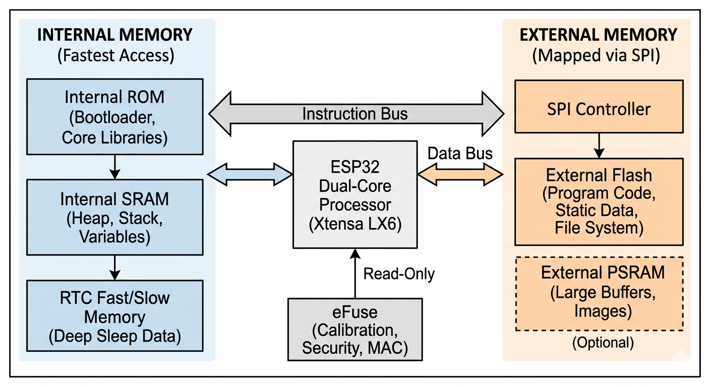
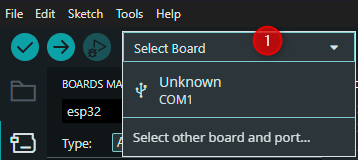
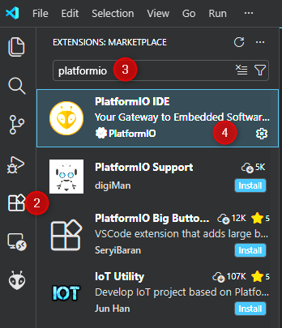
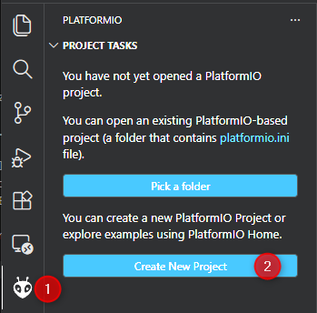
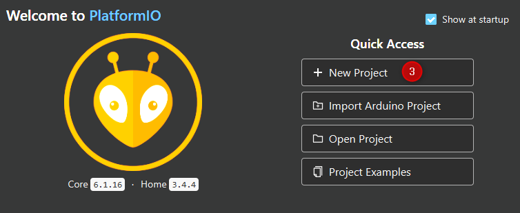
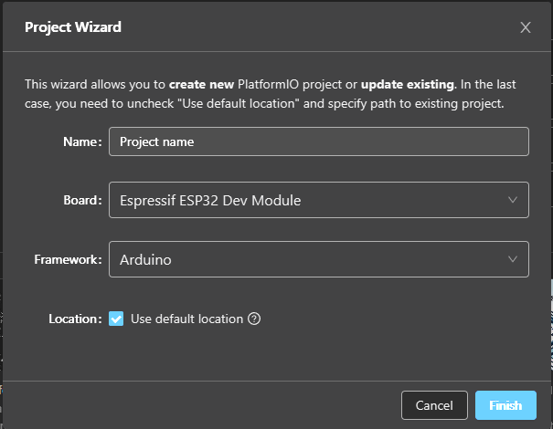
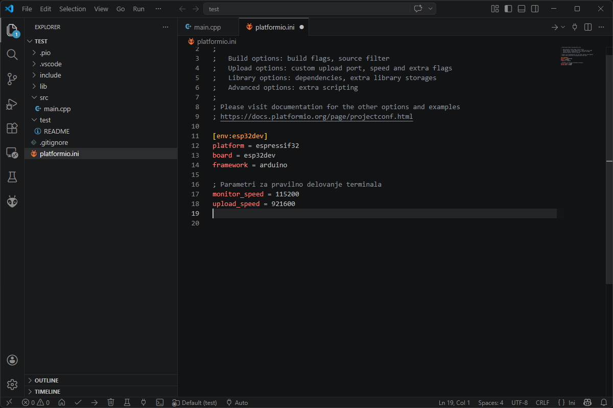

# ESP32: Arhitektura in strojna oprema ESP32

## 1.1 Strojna oprema (Hardware)

  ESP32 ni zgolj mikrokrmilnik, temveč System on a Chip (SoC), ki ga je razvilo podjetje Espressif Systems. Njegova glavna prednost pred predhodniki (npr. ESP8266 ali Arduino Uno) je integracija dveh procesorskih jeder ter vgrajenih modulov za Wi-Fi in Bluetooth komunikacijo.

Tehnične specifikacije (standardni model WROOM):
- Procesor: Xtensa® Dual-Core 32-bit LX6 (do 240 MHz).

- Pomnilnik: 520 KB notranjega SRAM; zunanji Flash (običajno 4 MB).

- Brezžična povezljivost: Wi-Fi 802.11 b/g/n in Dual-mode Bluetooth (Classic + BLE).

- Periferne enote: 12-bitni ADC, 8-bitni DAC, kapacitivna tipala na dotik, SPI, I2C, UART, PWM.


## 1.2 Različice in razvojne ploščice

Pri izbiri strojne opreme moramo razlikovati med čipom, modulom in razvojno ploščico.

- Čip: Goli silicij (npr. ESP32-D0WDQ6).

- Modul (npt. WROOM-32): Čip z dodanim kristalnim oscilatorjem, anteno in Flash pomnilnikom, zaprt v kovinsko ohišje.

- Razvojna ploščica (DevKit): Modul, nameščen na tiskano vezje (PCB) z USB-to-UART pretvornikom, regulatorjem napetosti (3,3 V) in pinskimi letvami za prototipiranje.

3. Družine ESP32:

- ESP32-S series: (S2, S3) Naprednejši modeli z več GPIO pini in podporo za USB native.

- ESP32-C series: (C3, C6) RISC-V arhitektura, cenovno dostopnejši, usmerjeni v nizko porabo

## 1.3 Različice in posebnosti

Ni vsak ESP32 enak. Razlikujejo se po številu jeder, moči in dodatkih.

| Različica        | CPU (arhitektura)     | Frekvenca | RAM / PSRAM        | Povezljivost                              | Poraba (približno)        | Opombe / Posebnosti                                      |
|------------------|------------------------|-----------|--------------------|-------------------------------------------|---------------------------|----------------------------------------------------------|
| ESP32            | Xtensa Dual-core       | do 240 MHz| ~520 KB / da       | Wi-Fi 4, BT Classic + BLE                 | ~80–260 mA aktivno        | Zrel, široka podpora, idealen za avdio                   |
| ESP32-S2         | Xtensa Single-core     | do 240 MHz| ~320 KB / da       | Wi-Fi 4                                  | ~20–80 mA                 | USB OTG, brez BT, bolj varčen                           |
| ESP32-S3         | Xtensa Dual-core       | do 240 MHz| ~512 KB / da       | Wi-Fi 4, BLE 5                           | ~30–100 mA                | AI (vector instrukcije), USB, LCD podpora               |
| ESP32-C3         | RISC-V Single-core     | do 160 MHz| ~400 KB / ne       | Wi-Fi 4, BLE 5                           | ~20–50 mA                 | Poceni, low-power, zamenjava za ESP8266                 |
| ESP32-C6         | RISC-V Single-core     | do 160 MHz| ~512 KB / ne       | Wi-Fi 6, BLE 5, 802.15.4                 | ~20–60 mA                 | Matter, Thread, prihodnost pametnih domov               |
| ESP32-H2         | RISC-V Single-core     | do 96 MHz | ~320 KB / ne       | BLE 5, 802.15.4                          | zelo nizka                | Brez Wi-Fi, ultra low-power mesh                        |
| ESP32-P4         | RISC-V Dual-core       | do 400 MHz| več MB / da        | brez wireless                            | odvisno od uporabe        | High-performance MCU, HMI, edge AI                      |




# 2 Strojna arhitektura in električne specifikacije


Za uspešno načrtovanje elektronskih vezij z ESP32 je nujno razumevanje fizičnih omejitev čipa, napajalnih protokolov in narave signalov.

## 2.1  Napajanje in napetostni nivoji

ESP32 je zasnovan na sodobni polprevodniški tehnologiji, ki deluje pri nizkih napetostih.

- Delovna napetost ($V_{CC}$): Nominalna napetost znaša 3,3 V. Operativno območje je med 2,2 V in 3,6 V.
- Vhodna napetost na razvojni ploščici (VIN/5V): Razvojne ploščice (npr. DevKit V1) vključujejo LDO (Low-DropOut) regulator napetosti, ki omogoča napajanje preko USB vrat (5 V) ali zunanjega vira do 9 V.
- Poraba toka: Med aktivnim prenosom podatkov preko Wi-Fi lahko tok naraste do 240 mA, v načinu globokega spanja (Deep Sleep) pa pade pod 10 µA.


**OPOZORILO**: Vhodno-izhodni pini (GPIO) niso tolerantni na 5 V. Priklop 5 V signala neposredno na pin bo povzročil prebitje izolacijske plasti znotraj čipa in trajno uničenje krmilnika.

## 2.2 Digitalni vhodi in izhodi (GPIO)

Vsi GPIO (General Purpose Input/Output) pini so programabilni, vendar se električno razlikujejo glede na svojo notranjo strukturo.

1. Logični nivoji (CMOS)
ESP32 uporablja CMOS logiko, kjer so pragovi za preklop naslednji:
- $V_{IL}$ (Input Low): Napetost pod 0,8 V se zazna kot **logična 0**.
- $V_{IH}$ (Input High): Napetost nad 2,4 V se zazna kot **logična 1**.
- $V_{OL} / V_{OH}$: Izhodna napetost pri polni obremenitvi je blizu 0 V oziroma 3,3 V.




2. Tokovne omejitve

Vsak GPIO pin lahko varno zagotavlja ali sprejema omejeno količino toka. 
Privzeta nastavitev je običajno **12 mA,** največja dovoljena pa **40 mA**. Skupni tok vseh pinov ne sme preseči omejitev toplotne disipacije čipa.

## 3. Pomnilniška arhitektura (Internal & External Storage)

Arhitektura ESP32 temelji na Harvardski zasnovi, kar pomeni, da uporablja ločena vodila za ukaze (instrukcije) in podatke. To omogoča procesorju sočasen dostop do obeh vrst informacij, kar bistveno poveča hitrost izvajanja operacij. Pomnilnik v ESP32 je hierarhično razdeljen na notranji (vgrajen v čip) in zunanji (povezan preko vodil).

## 3.3 Pomnilniška arhitektura (Internal & External Storage)

Arhitektura ESP32 temelji na **Harvardski zasnovi**, kar pomeni, da uporablja ločena vodila za ukaze (instrukcije) in podatke. To omogoča procesorju sočasen dostop do obeh vrst informacij, kar bistveno poveča hitrost izvajanja operacij.

Pomnilnik v ESP32 je hierarhično razdeljen na:
- **notranji (vgrajen v čip)**
- **zunanji (povezan preko vodil)**

---

### 3.3.1 Notranji pomnilnik (Internal Memory)

Notranji pomnilnik je integriran neposredno v silicijevo strukturo SoC (System on a Chip), kar omogoča najhitrejši dostop brez zakasnitev.

#### Internal ROM (Read-Only Memory)

- Vsebuje kritično kodo, ki je zapisana med proizvodnjo in je ni mogoče spreminjati.
- V njem se nahaja **Bootloader**, ki upravlja z zagonom čipa in nalaganjem kode preko UART/USB.
- Vključuje osnovne knjižnice za nizko-nivojsko delovanje (npr. matematične funkcije in osnovni Wi-Fi sklad).

#### Internal SRAM (Static Random Access Memory)

- Primarni delovni pomnilnik med izvajanjem programa.
- Uporablja se za:
  - dinamične podatke
  - spremenljivke
  - sklad (*stack*)
  - kopico (*heap*)
- Najhitrejši dostop, vendar **ni obstojen** (podatki se izgubijo ob izklopu).

#### RTC Fast Memory

- Majhen pomnilnik za podatke, ki morajo ostati dostopni po **Deep Sleep**.
- Uporablja ga predvsem **ULP koprocesor** (Ultra Low Power).

#### RTC Slow Memory

- Podoben RTC Fast Memory, vendar optimiziran za **nižjo porabo energije**.
- Hrani spremenljivke za takojšnjo uporabo po prebujanju.

---

### 3.3.2 Zunanji pomnilnik (External Memory)

Ker notranji pomnilnik pogosto ne zadostuje za kompleksne aplikacije, ESP32 uporablja dodatne zunanje komponente.

#### External Flash (Programski pomnilnik)

- Povezan preko **SPI vodila**.
- Vsebuje:
  - programsko kodo (firmware)
  - slike
  - spletne strani
  - statične podatke
- **Non-volatile** (podatki ostanejo brez napajanja).
- Procesor uporablja **cache (predpomnilnik)** za hitrejši dostop.

### External PSRAM (Pseudo-Static RAM)

- Prisoten pri nekaterih modulih (npr. WROVER).
- Uporaba:
  - obdelava slik
  - veliki bufferji
  - zahtevni strežniki
- Razširi omejen notranji SRAM.

### eFuse (Electronic Fuses)

- Enosmerno zapisljiv pomnilnik.
- Uporablja se za:
  - MAC naslov
  - kalibracijo ADC
  - varnostne ključe
  - sistemske nastavitve
- Ko je bit zapisan, ga ni mogoče spremeniti.

---

## 3.3.3 Virtualni naslovni prostor in MMU

ESP32 uporablja **MMU (Memory Management Unit)** za preslikavo zunanjega pomnilnika v naslovni prostor procesorja.

To omogoča:
- dostop do Flash in PSRAM kot da sta notranji pomnilnik
- enostavnejše programiranje
- večjo fleksibilnost

Kljub temu podatki fizično še vedno potujejo preko **SPI vodila**, kar pomeni nekoliko večjo latenco kot pri notranjem pomnilniku.




## 3 Datotečni sistemi v Flash pomnilniku

Zunanji Flash pomnilnik ESP32 je razdeljen na več particij. Ena particija je namenjena izvajanju programa (App), ostale pa lahko uporabimo kot virtualni trdi disk. Za upravljanje teh particij uporabljamo namenske datotečne sisteme.

---

## 3.1 SPIFFS (SPI Flash File System)

SPIFFS je bil dolga leta standard za ESP8266 in ESP32.

- **Zasnova:** Prilagojen za majhne Flash čipe, ki ne podpirajo pravih imenikov (podmap).  
- **Omejitve:** 
  - Ni dejanske strukture map; poti, kot je `/data/config.txt`, obravnava le kot dolgo ime datoteke.  
  - Ni podpore za preverjanje napak pri pisanju.  
  - Počasnejši pri delu z velikimi particijami.  
- **Status:** Danes velja za opuščenega (*Deprecated*), nadomešča ga **LittleFS**.

---

## 3.2 LittleFS (LITTLE File System)

LittleFS je sodobnejši in robustnejši datotečni sistem, trenutno priporočljiv za nove projekte na ESP32.

- **Odpornost na izpad napajanja:** Ob nenadni izgubi napajanja med pisanjem ne pride do poškodbe celotnega datotečnega sistema (*corruption resilience*).  
- **Dinamično porazdeljevanje obrabe (Wear Leveling):** Omejeno število ciklov pisanja Flash čipa (~100.000), LittleFS enakomerno porazdeli pisanje po celotnem čipu.  
- **Hitrost:** Hitrejše branje in iskanje datotek kot SPIFFS.  
- **Podpora mapam:** Omogoča pravo hierarhično strukturo map.

---

### 3.3 Particijska tabela (Partition Table)

Da datotečni sistem deluje, moramo v razvojnem okolju (PlatformIO) določiti, kolikšen del zunanjega Flasha bo pripadal kodi in kolikšen datotekam. To določimo s particijsko tabelo (.csv).

**Primer standardne razdelitve 4 MB Flash pomnilnika:**

| Particija        | Velikost | Namen |
|-----------------|-----------|-------|
| nvs             | 20 KB     | Shranjevanje Wi-Fi gesel in kalibracijskih podatkov |
| otadata         | 8 KB      | Podatki za brezžično posodabljanje (OTA) |
| app0            | 1.2 MB    | Glavni program |
| app1            | 1.2 MB    | Rezervni prostor za OTA posodobitev |
| spiffs/littlefs | 1.5 MB    | Prostor za uporabniške datoteke |

---

### 3.4 Praktična uporaba v IoT sistemih

- **Spletni strežnik:** HTML in CSS datoteke (`index.html`, `style.css`) shranimo v LittleFS namesto v C++ spremenljivke.  
- **Datalogger:** Meritve senzorjev v realnem času zapisujemo v datoteko `log.csv`, ki jo kasneje prenesemo za analizo.  
- **Konfiguracija:** Shranjevanje nastavitev naprave (npr. ime Wi-Fi omrežja), ki jih uporabnik nastavi preko spletnega vmesnika.


# 4. Razvojna okolja za ESP32

Za razvoj programske opreme (**firmware**) na platformi **ESP32** potrebujemo **integrirano razvojno okolje (IDE)**.  
V izobraževalne in profesionalne namene se poslužujemo dveh pristopov: enostavnejšega **Arduino IDE** in naprednejšega **VS Code s PlatformIO**.

---

## 4.1 Arduino IDE 2.x (Hitri razvoj in testiranje)

Novejša generacija Arduino IDE (2.0 in novejše) vključuje izboljšan **upravljalnik ploščic** in **serijski risalnik (Serial Plotter)**.

### Konfiguracija okolja

**Namestitev jedra (Core):**

1. V levi orodni vrstici izberite ikono **Boards Manager**.  
2. V iskalno polje vpišite `ESP32`.  
3. Poiščite paket **esp32 by Espressif Systems** in kliknite **Install**.  


**Izbira strojne opreme:**

1. Povežite ESP32 z računalnikom preko USB kabla.  
2. V spustnem meniju na vrhu (**Select Board**) izberite ustrezna **COM vrata** in model ploščice (npr. **ESP32 DEVKIT**).




---

# 4.2.1 Namestitev in začetna konfiguracija VS Code

Preden začnemo z razvojem, moramo vzpostaviti **programsko verigo (toolchain)**. Postopek namestitve razdelimo na tri sklope: namestitev urejevalnika, namestitev okolja PlatformIO in priprava prvega projekta.

---

## 1. Namestitev Visual Studio Code (VS Code)

**VS Code** je odprtokodni urejevalnik kode podjetja Microsoft, ki služi kot osnova za razvoj.

1. Obiščite uradno stran: [code.visualstudio.com](https://code.visualstudio.com/).  
2. Prenesite namestitveno datoteko za svoj operacijski sistem (Windows, macOS ali Linux).  
3. **Pomembno:** Med namestitvijo na Windows označite možnosti:
   - `Add to PATH`  
   - `Open with Code`  

To olajša kasnejše delo z datotekami in ukazno vrstico.

---

## 2. Namestitev vtičnika PlatformIO IDE

**PlatformIO** deluje kot razširitev znotraj VS Code in avtomatizira upravljanje s strojno opremo ter knjižnicami.

1. Odprite VS Code.  
2. V levi orodni vrstici kliknite na ikono **Extensions** (kvadratki) ali pritisnite `Ctrl+Shift+X`.  
3. V iskalno polje vpišite **PlatformIO IDE**.  
4. Kliknite **Install**.  




> Po namestitvi se v spodnjem levem kotu pojavi ikona **PlatformIO Home** (hišica), v levi vrstici pa ikona **glave mravlje ali čebelice**.  
> Prva namestitev lahko traja nekaj minut, saj PlatformIO v ozadju prenaša potrebna prevajalna orodja in Python okolje.

---

## 3. Postavitev novega projekta (Project Wizard)

Ustvarjanje projekta preko **PlatformIO Wizard** zagotavlja pravilno nastavitev strojne opreme že pred prvo vrstico kode.

1. Kliknite na **PlatformIO Home** (ikona hišice).  
2. Izberite **+ Create New Project**.  
3. Izberite **+ New Project**.  
4. V čarovniku za projekte izpolnite naslednja polja:
   - **Name:** Ime projekta (izogibajte se šumnikom in presledkom, npr. `vaja1_blink`).  
   - **Board:** Vpišite `esp32dev` in izberite **Espressif ESP32 Dev Module**.  
   - **Framework:** Izberite **Arduino**.  
5. Kliknite **Finish**. Sistem bo avtomatsko generiral strukturo map in datoteko `platformio.ini`.







---

## 4. Prva konfiguracija: platformio.ini

Po ustvarjanju projekta je priporočljivo dopolniti datoteko `platformio.ini` s parametri za **serijsko komunikacijo**, sicer bodo izpisi v terminalu neberljivi.

```ini
[env:esp32dev]
platform = espressif32
board = esp32dev
framework = arduino

; Parametri za pravilno delovanje terminala
monitor_speed = 115200
upload_speed = 921600

```

- **monitor_speed**: Določa hitrost osveževanja serijskega terminala (v bitih na sekundo - baud).

- **upload_speed**: Določa hitrost prenašanja binarne datoteke na ESP32 (višja vrednost skrajša čas čakanja).

**Preverjanje namestitve (Build & Upload)**
V spodnji modri vrstici VS Code se nahajajo ključni gumbi za upravljanje:

- **Kljukica (Build):** Preveri kodo glede sintaktičnih napak.

- **Puščica desno (Upload):** Prenese program na ploščico.

- **Vtič (Serial Monitor):** Odpre okno za spremljanje izpisa podatkov iz ESP32.




# 5. Osnove programiranja: Sintaksa C++ v okolju Arduino

**5.1 Osnovna struktura programa**

Vsak program (v Arduinu mu pravimo sketch) mora vsebovati dve glavni funkciji. Brez njiju se koda ne bo prevedla.

```c++
#include <Arduino.h> // Obvezno v PlatformIO, v Arduino IDE ni potrebno

// 1. Funkcija setup se izvede samo enkrat ob vklopu naprave
void setup() {
  // Tukaj nastavimo osnovne parametre (npr. hitrost komunikacije)
}

// 2. Funkcija loop se izvaja v neskončni zanki, dokler ima naprava napajanje
void loop() {
  // Tukaj pišemo glavno logiko (npr. branje senzorjev)
}
```

> **Funkcija setup()** se pokliče **le enkrat**, takoj ko mikrokrmilnik dobi napetost ali ko pritisnemo gumb Reset. Njen namen je konfiguracija okolja.
>V **setup()** običajno zapišemo:
>- Določitev smeri pinov (pinMode – ali bo pin vhod ali izhod).
>- Zagon serijske komunikacije (Serial.begin).
>- Povezovanje na Wi-Fi omrežje.
>- Inicializacijo senzorjev in zaslonov.

>**Funkcija loop()** – Srce programa
>Ko se setup() zaključi, procesor takoj vstopi v funkcijo loop(). Ko pride do zadnje vrstice v tej funkciji, ne neha delovati, ampak se takoj vrne na začetek te iste funkcije. To se ponavlja več tisočkrat v sekundi.
>V loop() običajno zapišemo:
>- Matematične izračune.
>- Vklapljanje in izklapljanje aktuatorjev (LED, motorji, releji).
>- Preverjanje spletnih zahtev.

>**Komentarji** so besedila, ki jih prevajalnik popolnoma prezre. Namenjeni so programerju, da razume, kaj določen del kode počne. Brez komentarjev je koda v profesionalnem okolju neuporabna. <br><br>
>V C++ poznamo dva načina komentiranja:
> - Enovrstični komentar: <br> Začne se z dvema poševnicama //. Vse, kar sledi do konca vrstice, je komentar.
> - Večvrstični komentar: <br> Začne se z /* in konča z */. Uporaben za daljša pojasnila ali začasno izključitev večjega dela kode.

**Analiza primera s komentarji**

```c++
#include <Arduino.h> // Obvezno v PlatformIO, v Arduino IDE ni potrebno

/* Projekt: Osnovni utrip (Blink)
   Avtor: i-Učbenik ESP32
   Opis: Program vklopi in izklopi vgrajeno LED diodo.
*/

void setup() {
  // Nastavimo GPIO pin 2 kot izhod (na tem pinu je na večini ploščic modra LED)
  pinMode(2, OUTPUT); 
  
  Serial.begin(115200); // Zagon serijskega terminala za izpis stanja
  Serial.println("Sistem se zagonja..."); // Izpis sporočila ob vklopu
}

void loop() {
  digitalWrite(2, HIGH); // Nastavi napetost na pinu 2 na 3.3V (LED zasveti)
  Serial.println("LED vklopljena");
  
  delay(1000);           // Premor za 1000 milisekund (1 sekunda)
  
  digitalWrite(2, LOW);  // Nastavi napetost na 0V (LED ugasne)
  Serial.println("LED izklopljena");
  
  delay(1000);           // Ponovni premor
  
  // Ko pridemo sem, se procesor vrne na začetek funkcije loop()
}
```

>**Zakaj je to pomembno?****<br>
Če bi kodo za utripanje napisali v 'setup()', bi lučka zasvetila in ugasnila samo enkrat, nato pa bi ESP32 miroval. Ker je koda v 'loop()', dobimo neprestano utripanje, ki je osnova za delovanje vseh avtomatiziranih sistemov.

# 5.2 Spremenljivke in podatkovni tipi

Spremenljivka je prostor v pomnilniku (RAM), kamor shranimo podatek. V jeziku C++ moramo obvezno določiti, kakšen tip podatka bomo shranili, da procesor ve, koliko prostora mora rezervirati.

| Tip    | Opis                          | Primer                              | Velikost v pomnilniku |
|--------|-------------------------------|-------------------------------------|------------------------|
| int    | Cela števila (brez vejice)    | int temperatura = 25;               | 4 bajti (na ESP32)     |
| float  | Števila z decimalkami         | float napetost = 3.32;              | 4 bajti                |
| bool   | Logična vrednost (DA/NE)      | bool luc_prižgana = true;           | 1 bajt                 |
| char   | En sam znak                   | char oznaka = 'A';                  | 1 bajt                 |
| String | Niz znakov (besedilo)         | String sporocilo = "Napaka!";       | Dinamična              |

# 5.4 Aritmetični operatorji

Za obdelavo podatkov uporabljamo standardne matematične znake:

- `+` (seštevanje)  
- `-` (odštevanje)  
- `*` (množenje)  
- `/` (deljenje)  
- `%` (modulo – ostanek pri deljenju, npr. `7 % 3` je `1`)


>**Vaja za razmišljanje:**<br>
Če imamo spremenljivko 'int x = 7;' in 'int y = 2;', kaj bo rezultat operacije 'float z = x / y;'?
Namig: Ker sta x in y celi števili (int), bo rezultat deljenja najprej celo število, šele nato se bo pretvorilo v float.

**Podrobna analiza primera: Seštevanje podatkov**

```c++ 
#include <Arduino.h>

void setup() {
  // Odpremo komunikacijski kanal med ESP32 in računalnikom
  Serial.begin(115200); 

  // Deklaracija in inicializacija spremenljivk
  int jabolka = 5;
  int hruske = 10;
  int sadje_skupaj; // Rezerviramo prostor, vrednosti še ni

  // Operacija seštevanja
  sadje_skupaj = jabolka + hruske;

  // Izpis rezultata na zaslon računalnika
  Serial.print("Skupno število sadežev: ");
  Serial.println(sadje_skupaj);
}

void loop() {
  // Prazna zanka - program je končal svoje delo v setupu
}
```

 **Analiza kode:**<br>
```c++ 
Serial.begin(115200);
```
Ta ukaz "zbudi" serijski vmesnik. Številka 115200 je hitrost (baud rate). Če v Monitorju v VS Code / Arduino IDE nastavite drugačno hitrost, boste namesto besedila videli čudne znake.

```c++ 
int sadje_skupaj;
```
Tukaj smo ustvarili spremenljivko, vendar ji nismo pripisali vrednosti. V pomnilniku se na tem mestu trenutno nahaja naključna vrednost ("smeti"), dokler ne izvedemo računa.

**Serial.print** izpiše besedilo v isti vrstici, 
**Serial.println** pa po izpisu skoči v novo vrstico.

## 5.4.1 **Praktični primeri računanja**

V jeziku C++ operacije izvajamo s pomočjo operatorjev. Rezultat operacije običajno shranimo v novo spremenljivko ali pa z njim posodobimo obstoječo.

- 1. **Seštevanje in odštevanje (Senzorski zamik)**

Uporabljamo ju za umerjanje (kalibracijo) senzorjev. Če vemo, da naš senzor temperature vedno kaže 2 stopinji preveč, vrednost popravimo:

```c++ 
float surova_temp = 24.5;
float popravljena_temp;

// Odštejemo offset (zamik)
popravljena_temp = surova_temp - 2.0; 

// Rezultat v popravljena_temp bo 22.5
```

- 2. **Množenje (Pretvorba enot)**
Uporabno pri pretvorbi napetosti iz ADC (Analogno-digitalnega pretvornika) v realne fizikalne enote.

```c++ 
int adc_vrednost = 2048;
float faktor = 0.0008; // Primer faktorja za pretvorbo v Volte
float napetost;

napetost = adc_vrednost * faktor;

// Rezultat v napetost bo 1.6384 V
```

- 3. **Deljenje in težava s celimi števili**

>**Pozor**: Če delite dve celi števili (int), bo rezultat vedno celo število, ostanek pa se zavrže.

```c++ 
int x = 5;
int y = 2;
float rezultat;

rezultat = x / y; 
// Rezultat bo 2.0 in NE 2.5! Ker sta x in y 'int', se izvede celoštevilsko deljenje.

rezultat = (float)x / y; 
// Rezultat bo 2.5. Z (float) smo procesorju ukazali, naj x obravnava kot decimalno število.
```

- 4. **Modulo % (Ostanek pri deljenju)**

To je eden najuporabnejših operatorjev pri programiranju mikrokrmilnikov. Vrne ostanek, ki ostane po celoštevilskem deljenju.

```c++ 
int sekunde = 125;
int preostale_sekunde;

preostale_sekunde = sekunde % 60;

// 125 / 60 je 2, ostanek je 5.
// Rezultat v preostale_sekunde bo 5.
```

>Uporaba: Modulo pogosto uporabljamo za ustvarjanje ciklov (npr. da se nekaj zgodi vsakih N ponovitev zanke).

- 5. Kombinirani operatorji (Inkrement in dekrement)

```c++ 
int stevec = 0;

stevec = stevec + 1; // Daljši zapis
stevec += 1;         // Krajši zapis
stevec++;            // Najpogostejši zapis (poveča za 1)

stevec--;            // Zmanjša vrednost za 1
```

**Analiza prednosti operacij**
C++ upošteva matematična pravila prednosti (množenje in deljenje imata prednost pred seštevanjem). Če želimo spremeniti vrstni red, uporabimo oklepaje:

```c++
float a = 2.0;
float b = 3.0;
float c = 4.0;
float rezultat;

rezultat = a + b * c;   // Rezultat: 14.0 (3 * 4 + 2)
rezultat = (a + b) * c; // Rezultat: 20.0 ((2 + 3) * 4)
```
**Vprašanja za vajo:**
- 1. Imamo 'int tocke = 10';. Kakšna bo vrednost po ukazu 'tocke *= 2;'?

- 2. Zakaj je operacija '10 / 3' v C++ enaka '3' in ne '3.33'?

- 3. Kako bi z operatorjem % ugotovili, ali je število sodo ali liho?


# 5.5 Logični tip podatkov (bool) in primerjalni operatorji

Spremenljivka tipa 'bool' (skrajšano za boolean) lahko hrani le dve vrednosti:

- 'true' (resnično / logična 1 / visoko stanje)

- false (neresnično / logična 0 / nizko stanje)

V pomnilniku ESP32 'bool' zavzame 1 bajt. Čeprav bi teoretično potrebovali le 1 bit, procesorji lažje upravljajo s celimi bajti (8 bit).

**Primerjalni operatorji (Ustvarjanje pogojev)**

Da dobimo logično vrednost ('true' ali 'false'), moramo podatke med seboj primerjati. Rezultat vsake spodnje operacije je tipa 'bool'.

| Operator | Opis                  | Primer     | Rezultat |
|----------|-----------------------|------------|----------|
| ==       | Je enako?             | 5 == 5     | true     |
| !=       | Ni enako?             | 5 != 3     | true     |
| >        | Večje kot?            | 10 > 20    | false    |
| <        | Manjše kot?           | 2 < 8      | true     |
| >=       | Večje ali enako?      | 5 >= 5     | true     |
| <=       | Manjše ali enako?     | 4 <= 3     | false    |


> **Pozor**: Začetniki pogosto zamenjajo = in ==.
>- 'a = 5;' pomeni: "V spremenljivko a shrani vrednost 5." (Prireditveni operator)
>- 'a == 5;' pomeni: "Preveri, ali je v a vrednost 5." (Primerjalni operator)

**Logični operatorji (Združevanje pogojev)**

Včasih moramo preveriti več stvari hkrati (npr. "Če je pritisnjena tipka **IN** je hkrati temperatura previsoka"). Za to uporabljamo logična vrata:

1. **Logični IN (operator '&&')**

Rezultat je 'true' le, če sta **oba** pogoja resnična.

```c++ 
bool tipka_pritisnjena = true;
bool alarm_aktiven = false;
bool rezultat;

rezultat = tipka_pritisnjena && alarm_aktiven; 
// Rezultat bo 'false', ker alarm ni aktiven.
```

2. **Logični ALI (operator '||')**

Rezultat je 'true', če je **vsaj eden** od pogojev resničen.

```c++ 
bool senzor_1 = true;
bool senzor_2 = false;
bool vklop_luci;

vklop_luci = senzor_1 || senzor_2;
// Rezultat bo 'true', ker je senzor_1 zaznal gibanje.
``` 

3. **Logični NE / Negacija (operator '!')**

Obrne vrednost: 'true' postane 'false' in obratno.

```c++ 
bool stanje_led = true;
bool novo_stanje;

novo_stanje = !stanje_led;
// Rezultat bo 'false'.
```
**Praktični primer v kodi**

// Definiramo prag temperature
float meja_temp = 30.0;
float trenutna_temp = 32.5;

// Preverimo stanje (ali je prevroče?)
bool je_prevroce = trenutna_temp > meja_temp; 

// Rezultat 'je_prevroce' bo true.

<blockquote>
 **Vprašanja za razumevanje:**<br>
- 1. Kakšna bo vrednost spremenljivke rezultat, če izvedemo: bool rezultat = (10 > 5) && (3 == 4);?<br>
- 2. Zakaj v programiranju ne moremo uporabiti le enega enačaja (=) za preverjanje enakosti?<br>
- 3. Kako bi z operatorjem ! spremenili vrednost spremenljivke vklopljeno iz true v false?
</blockquote>